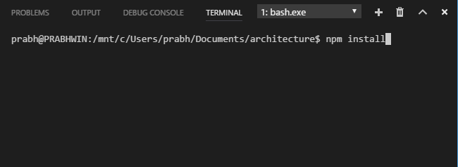
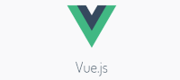

# 2. Frontend 

# Prequisities
> Please make sure you have all the [prequisites](prerequisites.md) configured before moving on.

Top Frontend frameworks:

we will discuss about the 3 top javascript libraries and frameworks in demand today.
These frameworks are hosted on npm Registry: [npm registry](https://www.npmjs.com/)

<details>
<summary>React</summary>

[Homepage](https://facebook.github.io/react/)

React project is actively maintained by facebook and community contributors


Let's start with React

> Install create-react-app CLI
```bash
npm install --global create-react-app@next
```

> How to create a new react project?
```bash
create-react-app <project-name>
```
> Open the project in IDE
```bash
code <project-name>
```

> Open integrated terminal inside vscode
 - <kbd>Ctrl + `</kbd>

> Install dependencies
```bash
npm install
```
- 

> Run project
```bash
npm start
```

> The react project should be running on port 3000 by default. Open google chrome and type 'http://localhost:3000' if it doesn't automatically pop up

Look out other cool [facebook open source solutions](https://code.facebook.com) 
</details>


<details>
<summary>Vue</summary>

[Homepage](https://vuejs.org)

VueJS project was started by Lone ranger [Evan You](http://evanyou.me) and some more awesome community contributors. You can think of VueJS as a hybrid of Angular and React.



To begin with VueJS

> Install vue-cli
```bash
npm install --global vue-cli
```

> How to create a new react project?
```bash
vue init webpack <project-name>
```
> Open the project in IDE
```bash
code <project-name>
```

> Open integrated terminal inside vscode
 - <kbd>Ctrl + `</kbd>

> Install dependencies
```bash
npm install
```

> Run project
```bash
npm start
```

> The vuejs project should be running on port 8080 by default. Open google chrome and type 'http://localhost:8080' if it doesn't automatically pop up

</details>

</details>

<details>
<summary>Angular</summary>

[Homepage](https://angular.io)

Angular was started back in 2009 by a Google employee Misko Hevery and has since grown widely popular


To get started with Angular

> Install Angular CLI
```bash
npm install --global @angular/cli
```
```bash
ng version
```

> How to create a new Angular project?
```bash
ng new <project-name> \
    --routing \
    --style=scss \
    --skip-install=true \
    --skip-git=true \
```
> Open the project in IDE
```bash
code <project-name>
```

> Open integrated terminal inside vscode
 - <kbd>Ctrl + `</kbd>

> Install dependencies
```bash
npm install
```

> Run project
```bash
npm start
```

> The Angular project should be running on port 4200 by default. Open google chrome and type 'http://localhost:4200' if it doesn't automatically pop up

Browse some of more awesome [Google open source solutions](https://opensource.google.com/) 
</details>

</details>

# What to do next
[System Deign Primer](https://github.com/donnemartin/system-design-primer)

[Next](backend.md)