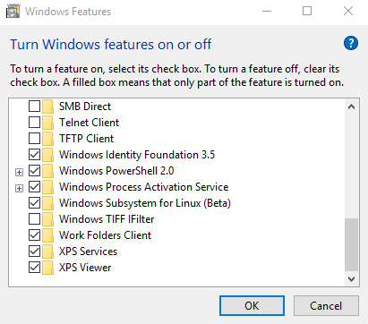

## 1. Prerequisites

- Enable **Windows Subsystem for Linux** in 'Turn Windows Features On or Off' Tool



- Open bash Shell. Please note, we will not be using Powershell or Windows Command Prompt during the entire project setup


- Type in Terminal the below commands to verify we have required tooling to begin with
```bash
git --version
c

node -v
> v7.8.0

npm -v 
> 4.4.4

yarn -V
> 0.22.0
```
----------


## IDE

>  Download [Visual Studio Code](https://code.visualstudio.com/)
   - Configure Default Shell as WSL Bash (Press <kbd>Ctrl + Shft + P</kbd> inside editor and type in Default Shell )
   - 


[Next: Frontend](frontend.md)